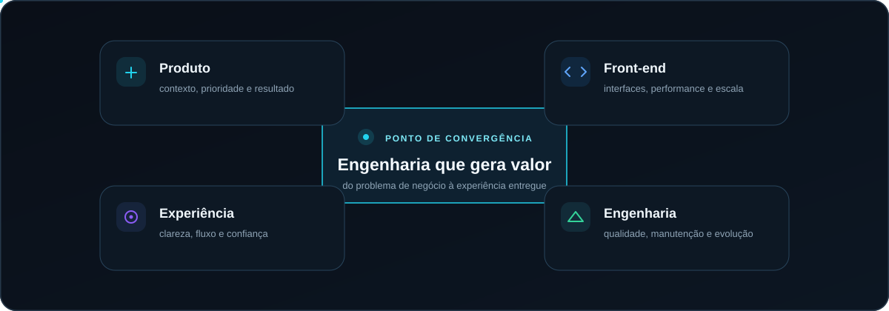
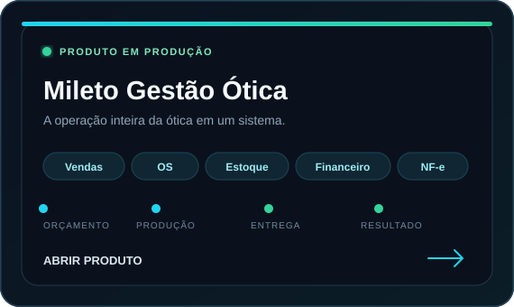
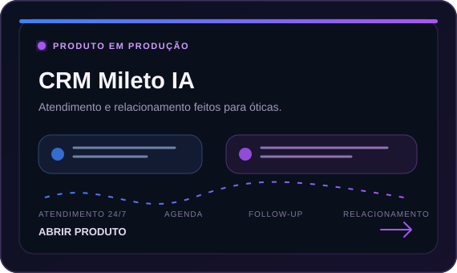
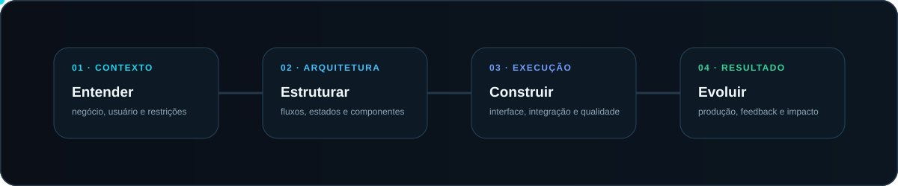

<div align="center">
  
</div>

<p align="center">
  <strong>Construo produtos digitais que transformam operações complexas em experiências simples.</strong>
</p>

<p align="center">
  <a href="#engenharia-que-gera-valor">Atuação</a>
  &nbsp;·&nbsp;
  <a href="#produtos-em-produção">Produtos</a>
  &nbsp;·&nbsp;
  <a href="#como-eu-construo">Processo</a>
  &nbsp;·&nbsp;
  <a href="#atividade-de-desenvolvimento">Atividade</a>
</p>

---

## Sobre

Sou **Gabriel Almeida**, engenheiro de software com foco em front-end e produtos digitais. Minha atuação conecta contexto de negócio, arquitetura de interface, experiência do usuário e qualidade de execução.

Trabalho especialmente bem em sistemas com regras, fluxos e operações complexas — transformando tudo isso em software claro para quem usa, sustentável para quem mantém e valioso para o negócio.

> **Meu objetivo não é apenas entregar telas. É construir produtos que organizam operações, reduzem atrito e continuam evoluindo.**

## Engenharia que gera valor

<div align="center">
  
</div>

## Produtos em produção

Atuo profissionalmente na construção e evolução dos produtos abaixo. Como são soluções proprietárias, o código-fonte e as decisões internas permanecem privados; os links apresentam publicamente o produto e o problema de negócio que ele resolve.

<table>
  <tr>
    <td width="50%" valign="top">
      <a href="https://miletogestaootica.com.br/" target="_blank">
        
      </a>
      <br />
      <sub><strong>Gestão de ponta a ponta:</strong> vendas, ordens de serviço, estoque, financeiro, NF-e, acompanhamento de pedidos e operação multiunidade.</sub>
    </td>
    <td width="50%" valign="top">
      <a href="https://crm.miletoia.com.br/" target="_blank">
        
      </a>
      <br />
      <sub><strong>Relacionamento especializado:</strong> atendimento contínuo, agendamentos, confirmações, follow-up, reativação de clientes e histórico centralizado.</sub>
    </td>
  </tr>
</table>

<p align="center">
  <a href="https://miletogestaootica.com.br/"><strong>Conhecer o Mileto Gestão Ótica ↗</strong></a>
  &nbsp;&nbsp;&nbsp;·&nbsp;&nbsp;&nbsp;
  <a href="https://crm.miletoia.com.br/"><strong>Conhecer o CRM Mileto IA ↗</strong></a>
</p>

## Como eu construo

<div align="center">
  
</div>

### Frentes de atuação

| Front-end Engineering | Product Engineering | Experiência e qualidade |
| :--- | :--- | :--- |
| Interfaces responsivas, estados complexos e componentes sustentáveis. | Regras de negócio, integrações, fluxos operacionais e evolução contínua. | Clareza, consistência, performance e redução de atrito para o usuário. |

### Princípios

```text
Contexto antes do código.
Produto antes da ferramenta.
Clareza antes da complexidade.
Qualidade que pode ser percebida e mantida.
```

## Atividade de desenvolvimento

<div align="center">
  <a href="https://github.com/Ashutosh00710/github-readme-activity-graph">
    
  </a>
</div>

<div align="center">
  
</div>
